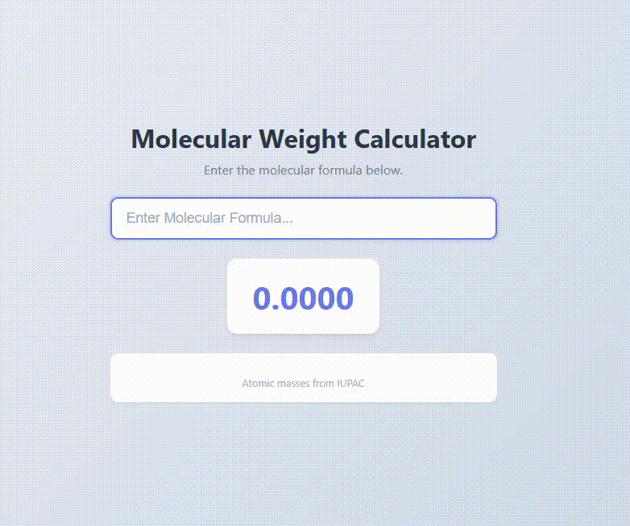

# Molecular Mass Calculator

Calculates the molecular mass (molar mass) of a chemical formula _as you type it_.

## Features

- **Real-time calculation** — results update on every keystroke
- **Parentheses support** — handles nested groups like `Mg(OH)2` and `Fe2(SO4)3`
- **Detailed breakdown** — shows each element, its atomic mass, count, and contribution to the total
- **Atomic mass reference** — values sourced from IUPAC, displayed per element

## Usage

Type a chemical formula into the input field. Examples:

| Formula | Name |
|---------|------|
| `H2O` | Water |
| `Mg(OH)2` | Magnesium hydroxide |
| `Ca(NO3)2` | Calcium nitrate |
| `Fe2(SO4)3` | Iron(III) sulfate |
| `C6H12O6` | Glucose |
